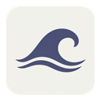
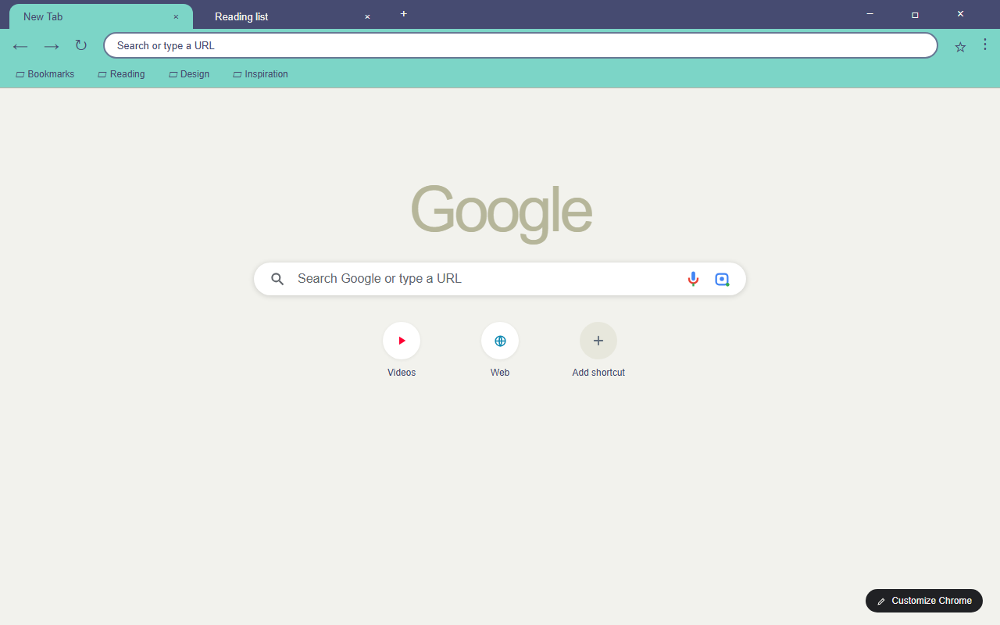

  

<h1 align="center">Indigo Lagoon Theme</h1>

A calm Chrome theme with muted indigo, lagoon blue, and refreshing mint.

  
  
  

## About

Indigo Lagoon Theme brings a calm coastal feeling to your browser. It pairs a muted indigo window frame with a refreshing mint toolbar and a soft off-white new-tab page, using lagoon blue as the accent for links and headers. The design is pure solid color — no wallpaper, no textures, no gradients — keeping a clean, premium, and distraction-free workspace.

## Color Palette

| Token | Hex | Usage |
|-------|-----|-------|
| Muted Indigo | `#464B71` | Browser frame, tab / toolbar / omnibox text & icons, buttons |
| Mint | `#7CD5C7` | Toolbar and bookmark bar |
| Lagoon Blue | `#118AB2` | Links, new-tab headers, accent color |
| Off-White | `#F2F2ED` | New-tab page background, inactive tab text |
| White | `#FFFFFF` | Omnibox (address bar) background |

## Features

- Calm muted-indigo + mint + lagoon-blue palette inspired by a quiet coastal lagoon.
- Solid color design with no images, textures, or gradients for a lightweight look.
- Carefully tuned contrast for readable tabs, toolbar, and address-bar text.
- Clean, distraction-free new-tab page.
- Pure theme: no scripts, no permissions, nothing collected.

## Install

### From source (unpacked)

1. Download or clone this repository.
2. Open Chrome and navigate to `chrome://extensions`.
3. Enable **Developer mode** in the top-right corner.
4. Click **Load unpacked** and select this folder.

### From Chrome Web Store

Search for **Indigo Lagoon Theme** in the Chrome Web Store and install it.

## Preview

## Files

| File | Description |
|------|-------------|
| `manifest.json` | Chrome theme manifest (MV3) with inline `theme` config |
| `logo/logo128.png` | Chrome Web Store icon (128x128) |
| `store-assets/screenshots/en/` | Store listing screenshots (1280x800) |
| `store-assets/promo/` | Promo tiles (440x280 and 1400x560) |
| `store-assets/store-description.txt` | Store listing detailed description (English) |

## License

Non-Commercial License — personal use permitted. Commercial use requires permission.
